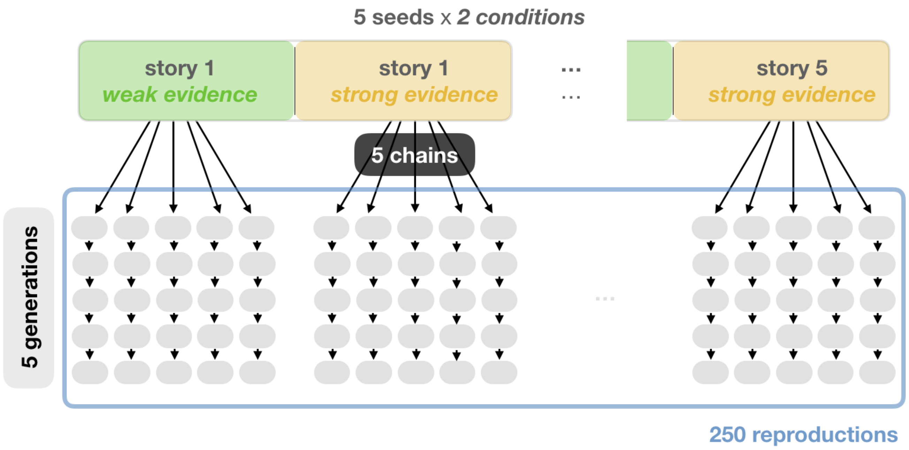

# The Annotated Iterated Narration Corpus (AINC)

The AINC is a corpus of crime stories and retellings of it. We're working on a user-friendly interface and documentation right now, but feel free to already use it. The corpus is available in three versions, including different information. You can learn about the versions and download the csv files [here](https://github.com/elisakreiss/iteratednarration/tree/master/corpus).

## About the corpus

The corpus consists of 260 stories that are annotated with human judgments mainly on guilt-related questions. 10 of these stories are the original seed stories. Those were reproduced (5 chains per seed) and those reproductions were again reproduced (5 generations per chain) similar to the game of Telephone. Thus, each seed story has 5 chains with 5 reproductions each, resulting in 250 reproductions in total.

## Seed stories

The seed stories describe 5 different criminal events: arson, destruction of bee hives, email scam, sexual harassment, smuggling. They all had a similar structure. First, the crime is reported, then an arrest, the charges and possible sentence if found guilty, and lastly a manipulation that casts doubt about the arrest or reaffirms it. Thus, each story occurs in a strong and weak evidence condition, which results overall in 10 seed stories.

The stories were all of similar length (about 900 characters, 170 words). 

All stories had various hedges in them. We balanced the number and relevance for the story of likelihood (e.g., allegedly responsible), impreciseness (e.g., about) and discrete number (e.g., 37 years) terms. We also balanced whether imprecise terms were directional (e.g., nearly), or not (e.g., about).

## Reproductions

Participants read a story and after it disappeared, they reproduced it. You can try out the experiment [here](https://elisakreiss.github.io/iteratednarration/experiments/02_main/01_reproduction-inLab/index.html).

For more information about the corpus construction, please have a look at our paper "Uncertain evidence statements and guilt perception in iterative reproductions of crime stories" (Proceedings of the Annual Meeting of the Cognitive Science Society 2019).



## Annotations

All stories are annotated with human judgments. Each participant only saw one story and answered all questions (+ 4 attention check questions; order randomized). You can try out the experiment [here](https://elisakreiss.github.io/iteratednarration/experiments/02_main/02_subjective-ratings/index-251.html).

1) How strong is the evidence for the suspect's / suspects' guilt?
2) How likely is it that the suspect is / the suspects in the crime are guilty?
3) How likely is a conviction of the suspect(s) in the crime?
4) How justified would a conviction of the suspect(s) in the crime be?
5) How much does the author believe that the suspect is guilty?
6) How much do you trust the author?
7) How objectively / subjectively written is the story?
8) How affected do you feel by the story?

Before the stories were given out for annotations, all main characters/potential suspects were marked in the stories to avoid confusion. When a suspect is mentioned in the question, we added the comment "(i.e., the person/people underlined in the story)" after it. In few cases, there was no suspect/main character in the story anymore so that nothing could be underlined. Then it was left to the participant to interpret the question and the comment was removed.

Responses were indicated on a slider, underlyingly encoded as a continuous scale between 0 and 100. Each story received approximately 20 annotations for each question, covering the whole range.

## Citation

If you use our corpus, please cite us with the paper that introduced the collection of the stories and their annotations.

```
@inproceedings{Kreiss:2019,
	Author = {Kreiss, Elisa and Franke, Michael and Degen, Judith},
	Booktitle = {Proceedings of the Annual Meeting of the Cognitive Science Society},
	Title = {Uncertain evidence statements and guilt perception in iterative reproductions of crime stories},
	Volume = {41},
	Year = {2019}}
```