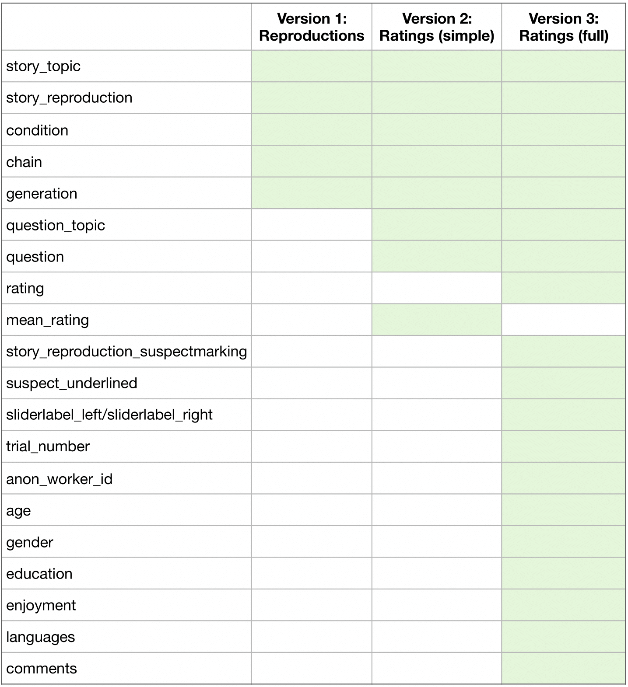

# The Annotated Iterated Narration Corpus (AINC) -- Versions

For information about the corpus collection, you can find an overview [here](https://github.com/elisakreiss/iteratednarration).

We provide three versions of the corpus, differing in the complexity of and information provided in the corpus. The following table provides an overview on which information is included in which version of the corpus. A green cell indicates that this particular column is present in the respective corpus version. You can find more detailed descriptions of the columns and version differences below.

## Version 1: Reproductions

This corpus only consists of the seed stories and reproductions, without any ratings. There are 260 rows, where each row is either a seed story (where *generation* and *chain* are set to 0) or a reproduction. The columns in the corpus contain the following information:

- **story_topic**: The original topic of the story. (levels: *arson, bees, professor, scam, smuggler*)
- **story_reproduction**: The exact story the reader saw.
- **condition**: The evidence manipulation that the story resulted from. (levels: *weak evidence, strong evidence*)
- **chain**: The unique chain ID that this particular story belongs to.
- **generation**: The generation the story belongs to. (levels: *0,1,2,3,4,5*, where 0 is the seed story and 1-5 are the reproductions)

## Version 2: Ratings (simple)

This corpus version includes the mean ratings provided by participants for each of the eight guilt related questions for each seed story and reproduction. This results in 2080 rows, where each row represents the mean of all human judgments for a question given a story. This corpus extends version 1 by the following columns:

- **question_topic**: The kind of question, the reader responded to. (levels: *suspect_committedCrime, suspect_conviction, suspect_convictionJustified, evidence, author_trust, reader_emotion, story_subjectivity, author_belief*)
- **question**: The exact wording of the question.
- **mean_rating**: The mean rating over participants for each question-story pair. Responses were given on a slider scale, underlyingly coded as ranging from 0 to 100.

## Version 3: Ratings (full)

While version 2 provides the mean ratings, this full version has the raw ratings each participant gave. The column **mean_rating** is therefore replaced by a raw **rating** column.

- **rating**: The rating that indicates the reader's response on a slider scale, underlyingly coded as ranging from 0 to 100.

In addition to the raw ratings, it also shows which person was marked as the suspect, and provides additional information about the participants.
Each row represents a human judgment for a question given a story. This corpus extends version 2 by the following columns.

- **story_reproduction_suspectmarking**: When participants answered the questions about a suspect, they were told that the relevant person was underlined in the story. This column is identical to *story_reproduction*, except that it includes the information which person in the story was underlined and was being referred to as "suspect".
- **suspect_underlined**: In a small number of cases, the reproductions did not include a suspect anymore. This boolean column indicates whether a suspect was underlined in the story, or not.
- **sliderlabel_left**/**sliderlabel_right**: The labels that participants saw on the left and right of the slider.
- **trial_number**: At which position in the experiment did a particular participant see a particular question.
- **anon_worker_id**: Worker id that was randomly assigned to the participants.

And some information we collected about the participants:

- **age**
- **gender**
- **education**
- **enjoyment**
- **languages**: The language spoken at home.
- **comments**: Comments that participants wrote at the end of the experiment.